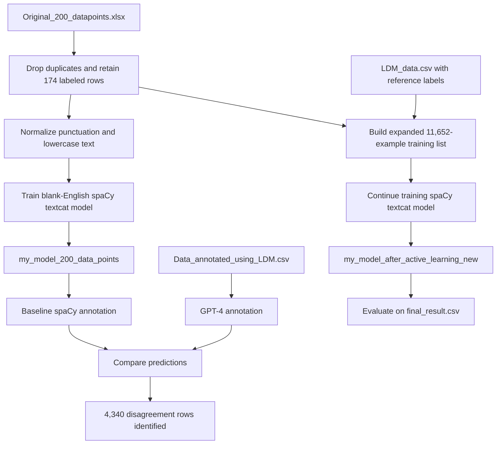

# Machine Learning Technical Debt Detection with Large Disagreement Modeling

This project explores binary classification of source-code comments as **machine learning technical debt (MLTD)** or **not MLTD**. It starts with a small human-annotated corpus, trains a lightweight spaCy text classifier, compares that classifier with GPT-4 annotations, identifies examples on which the two models disagree, retrains the spaCy classifier with a larger labeled dataset, and evaluates the available classifiers on a 100-comment result set.

> **Label convention:** `Yes` means that a comment is classified as ML technical debt; `No` means that it is not.

## Objectives

- Train a baseline MLTD classifier from the labeled portion of an existing research dataset.
- Use GPT-4 and the baseline spaCy model as two independent annotators for a larger comment corpus.
- Apply **Large Disagreement Modeling (LDM)** to isolate samples where those annotators disagree.
- Retrain a spaCy classifier using the expanded labeled data.
- Compare baseline, post-retraining, and external SATD predictions on a held-out result file.

## Repository contents

| Path | Verified contents | Role |
|---|---:|---|
| `Final_Project_Code.ipynb` | 71 cells: 65 code, 6 Markdown | End-to-end analysis and modeling workflow |
| `Original_200_datapoints.xlsx` | 1 sheet, 1,107 rows × 13 columns | Original repository/comment metadata and partial human annotations |
| `Data_annotated_using_LDM.csv` | 13,327 rows × 1 column; 1 null comment | Raw comments submitted to the annotation stage |
| `GPT-annotated-points_2.csv` | 13,327 rows × 5 columns | Comments with GPT-4, spaCy, ground-truth shorthand, and SATD-predictor labels |
| `LDM_data.csv` | 11,478 rows × 5 columns | Cleaned/assembled training data used by the notebook's second training stage |
| `final_result.csv` | 100 rows × 6 columns | Evaluation comments, reference labels, two stored spaCy prediction columns, and SATD predictions |
| `my_model_200_data_points/` | spaCy English `textcat` pipeline | Baseline model saved after the first 50-epoch training run |
| `my_model_after_active_learning_old/` | spaCy English `textcat` pipeline | Earlier post-learning model artifact; not loaded by the supplied notebook |
| `my_model_after_active_learning_new/` | spaCy English `textcat` pipeline | Post-retraining model loaded for the notebook's final inference step |

All three saved spaCy pipelines expose one `textcat` component with `Yes` and `No` labels, no word vectors, and model metadata requiring spaCy `>=3.6.1,<3.7.0`.

### Dataset details

#### `Original_200_datapoints.xlsx`

The workbook contains the sheet `mltd_label_dataset`. Its 13 fields cover dataset/repository identifiers, filenames, introducing and removing revisions, a direct GitHub file link, the comment text, the binary `MLTD?` label, broad and specific debt types, and ML-pipeline stage.

The notebook removes 6 duplicate rows, leaving 1,101 records, then retains the 174 records with a non-null `MLTD?` value:

| Label | Count | Share |
|---|---:|---:|
| `Yes` | 128 | 73.6% |
| `No` | 46 | 26.4% |

Although the filename refers to 200 data points, the verified workbook contains 1,107 rows and only 174 labeled rows after deduplication.

#### Annotation and LDM files

`Data_annotated_using_LDM.csv` contains 13,327 rows but only 9,536 unique non-null comment strings. `GPT-annotated-points_2.csv` adds four annotation fields to those comments. Its `actual_MLTD_label` uses `y`/`n`, whereas the downstream `LDM_data.csv` standardizes the same concept to `Yes`/`No`.

Of the 11,478 rows in `LDM_data.csv`, 9,536 have both GPT-4 and baseline spaCy predictions; the remaining 1,942 have null values in both model-prediction columns and in `SATD_predictor`. Within the 9,536 jointly predicted rows:

| GPT-4 vs. spaCy outcome | Rows |
|---|---:|
| Both predict `Yes` | 4,264 |
| Both predict `No` | 932 |
| Predictions disagree | 4,340 |

The complete `LDM_data.csv` reference labels contain 8,109 `Yes` samples (70.6%) and 3,369 `No` samples (29.4%).

## Methodology and pipeline



### 1. Load and filter the original annotations

The notebook reads `Original_200_datapoints.xlsx`, removes exact duplicate rows, and discards rows whose `MLTD?` value is missing. This produces the 174-example seed corpus.

### 2. Preprocess comments

Comment text is normalized by:

1. translating a fixed set of punctuation and special characters to spaces; and
2. converting text to lowercase.

The code does not tokenize, stem, lemmatize, collapse repeated whitespace, or preserve code-specific punctuation as separate features.

### 3. Train the baseline spaCy classifier

The notebook creates `spacy.blank("en")`, adds an exclusive `textcat` component, and registers `Yes` and `No`. Each labeled comment is converted to a spaCy `Example` with categorical targets.

Training uses:

- 50 epochs;
- shuffled examples each epoch;
- minibatches of 8; and
- dropout of 0.5.

The embedded training output shows text-classification loss falling from approximately **4.741** in epoch 1 to **0.0017** in epoch 50, with substantial fluctuation between epochs. This is training loss on the seed examples, not held-out validation performance. The resulting pipeline is saved to `my_model_200_data_points/`.

### 4. Produce GPT-4 and baseline spaCy annotations

The `GPT_Preds` helper constructs a binary-classification prompt and calls the legacy Chat Completions endpoint with model name `gpt-4`. The API key is read from `OPENAI_API_KEY` after loading environment variables with `python-dotenv`.

In parallel, the baseline spaCy pipeline predicts the highest-scoring category for every preprocessed comment. The supplied `GPT-annotated-points_2.csv` preserves the resulting GPT-4 and spaCy labels.

### 5. Select model agreements and disagreements

The notebook partitions rows with two predictions into:

- both-model `Yes` agreements;
- both-model `No` agreements; and
- GPT-4/spaCy disagreements (`data_to_be_annotated`).

It prints separate reports for the agreement subsets. These reports mostly confirm the purity of fixed-prediction subsets and should not be interpreted as general classifier performance: the both-`Yes` subset contains only `Yes` predictions, while the both-`No` subset contains only `No` predictions.

### 6. Build the expanded training set and retrain

The second training list contains the 174 original labeled examples plus all 11,478 rows in `LDM_data.csv`, for **11,652 examples** in total. The notebook then defines another 50-epoch update loop and saves `my_model_after_active_learning_new/`.

Important implementation detail: although the notebook identifies 4,340 disagreement rows, the supplied retraining cell iterates over **all** of `LDM_data.csv`, not just `data_to_be_annotated`. The README therefore uses “post-retraining” when precision matters; the current code is not a conventional disagreement-only active-learning loop.

The retraining, save, and post-retraining loss-plot cells do not contain execution counts or embedded outputs in the supplied notebook. The saved model folder demonstrates that a model artifact exists, but the notebook alone does not preserve that run's loss history.

### 7. Evaluate the classifiers

`final_result.csv` contains 100 unique comments with 75 `Yes` and 25 `No` reference labels. It stores predictions from:

- `spaCy_Predicted_MLTD_label_BAL`: the baseline/before-active-learning column;
- `spaCy_Predicted_MLTD_label_AAL`: a stored after-active-learning column; and
- `SATD_predictor`: an external comparison prediction.

The notebook also reloads `my_model_after_active_learning_new/`, predicts the same comments into a newly created `spaCy_Predicted_MLTD_AAL` column, and prints a separate report for those freshly computed predictions.

## Verified outputs and results

### Metrics stored in `final_result.csv`

These values are recomputed directly from the supplied CSV rather than copied from notebook display text:

| Prediction column | Accuracy | `No` precision / recall / F1 | `Yes` precision / recall / F1 |
|---|---:|---:|---:|
| Baseline spaCy (`..._BAL`) | 0.78 | 0.80 / 0.16 / 0.27 | 0.78 / 0.99 / 0.87 |
| Stored post-learning spaCy (`..._AAL`) | 0.76 | 0.57 / 0.16 / 0.25 | 0.77 / 0.96 / 0.86 |
| SATD predictor | 0.70 | 0.41 / 0.44 / 0.42 | 0.81 / 0.79 / 0.80 |

The stored baseline spaCy predictions favor the majority `Yes` class strongly: 95 of 100 predictions are `Yes`. The stored post-learning column predicts `Yes` 93 times. Consequently, overall accuracy is much higher than minority-class recall; the baseline identifies only 4 of the 25 `No` samples.

### Dynamically recomputed notebook result

The supplied notebook's embedded output for the freshly loaded `my_model_after_active_learning_new` model reports:

- accuracy: **0.75**;
- macro F1: **0.66**;
- weighted F1: **0.75**;
- `No` precision/recall/F1: **0.50 / 0.48 / 0.49**; and
- `Yes` precision/recall/F1: **0.83 / 0.84 / 0.83**.

This output is distinct from the pre-existing `spaCy_Predicted_MLTD_label_AAL` column in `final_result.csv`. Re-running the notebook creates a new similarly named column (`spaCy_Predicted_MLTD_AAL`), so reports should state explicitly which prediction source they use.

## Code walkthrough

| Notebook cells | Purpose |
|---|---|
| 0–4 | Import dependencies and inspect the original workbook |
| 5–10 | Deduplicate, retain labeled rows, and inspect class balance |
| 11–14 | Normalize comment text |
| 15–24 | construct, train, plot, and save the baseline spaCy classifier |
| 25–31 | Define the GPT-4 client and generate GPT-4/spaCy predictions |
| 32–43 | Load LDM data and divide predictions into agreement/disagreement subsets |
| 44–49 | Assemble expanded training examples and define post-learning training/save/plot steps |
| 50–58 | Load the final result set, run the saved model, and print classification reports |
| 59–70 | Empty code cells |

## Setup

Python 3.10 is a safe choice because the notebook's recorded environment paths reference Python 3.10 and the saved model metadata targets spaCy 3.6.x.

```bash
python -m venv .venv
source .venv/bin/activate            # Windows: .venv\Scripts\activate
python -m pip install --upgrade pip
python -m pip install \
  "spacy>=3.6.1,<3.7.0" \
  pandas openpyxl requests python-dotenv \
  matplotlib scikit-learn jupyter
```

Create a `.env` file only if you intend to regenerate GPT annotations:

```dotenv
OPENAI_API_KEY=your_api_key_here
```

Do not commit `.env` or API credentials.

## How to run

1. Clone or download the project and keep the notebook, tabular files, and model directories together at the repository root.
2. Create and activate the environment described above.
3. Start Jupyter:

   ```bash
   jupyter notebook Final_Project_Code.ipynb
   ```

4. Run cells in order, reviewing the reproducibility notes below before executing the GPT annotation and retraining sections.

If the goal is only to inspect the supplied results, skip the GPT API loop and training cells and load the included CSV/model artifacts directly.

## Reproducibility notes

- **No fixed random seed:** Python's `random`, spaCy initialization, shuffling, and dropout are not seeded. Training and inference results may differ across runs.
- **No initial train/validation split:** all 174 seed labels are used for baseline training. The plotted loss is not validation loss.
- **External API variability:** regenerating GPT labels depends on API availability, model access, model-version behavior, prompt interpretation, and cost. The hard-coded `gpt-4` identifier and Chat Completions request may require updating for a current OpenAI account/API version.
- **API loop is incomplete in the saved execution:** the GPT annotation cell has no execution count or embedded output. The supplied annotated CSV should be treated as the preserved annotation artifact.
- **Broad exception handling:** the GPT loop catches every exception, sleeps for 60 seconds, and does not log the cause or retry the same row explicitly. Add bounded retries, timeouts, and durable checkpoints before a production run.
- **Artifact-derived stages:** `LDM_data.csv`, reference labels, `SATD_predictor`, and `final_result.csv` are consumed by the notebook but not fully generated by preceding executable cells. Their upstream collection/annotation procedures are not present in this repository.
- **Duplicate comments:** the raw LDM input contains repeated comment strings (13,326 non-null rows but only 9,536 unique comments). Split data by repository or deduplicated comment group to prevent leakage in future experiments.
- **Model compatibility:** use spaCy 3.6.x as recorded in each saved model's `meta.json`.
- **Preserve input copies:** several cells mutate DataFrames in place. Work from version-controlled inputs and write new output filenames during experimentation.
- **Execution order matters:** notebook execution counts are non-sequential, and multiple later cells are unexecuted. Restart the kernel and run top-to-bottom after fixing the issues above for a clean experiment.
- **Exact provenance:** add source citations, annotation guidelines, annotator identities/agreements, dataset licenses, and a description of how the 100 evaluation rows were sampled before publishing research claims.

For strict experiment tracking, record the Python/package lockfile, random seeds, model/API version, prompt, input checksums, timestamp, and train/evaluation split with every run.

## Limitations

- The seed corpus is small and imbalanced, and the larger LDM data remains approximately 71% `Yes`.
- A blank-English spaCy text classifier with no pretrained vectors has limited semantic context and does not model source code surrounding each comment.
- Removing punctuation can discard meaningful code signals such as operators, paths, function syntax, issue markers, and TODO/FIXME formatting.
- The current evaluation has only 100 rows and a 75:25 class split; accuracy alone overstates performance on the minority `No` class.
- The two annotators are not independent ground truth. Agreement can reinforce shared bias, and disagreement does not automatically identify the most informative or correctly labeled samples.
- The post-learning code does not isolate the disagreement pool during retraining and does not document a human-in-the-loop query/annotation cycle.
- The notebook contains `SettingWithCopyWarning` messages in agreement-subset transformations and undefined-metric warnings where a subset contains only one predicted class.
- No statistical uncertainty, cross-validation, calibration, threshold analysis, repository-level split, or leakage analysis is included.

